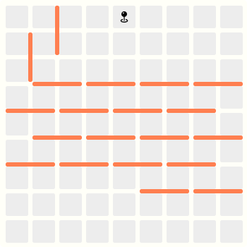
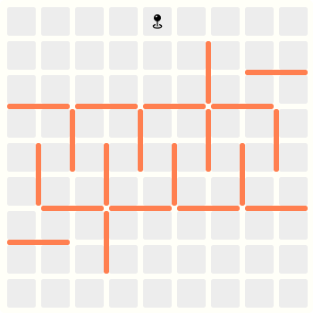
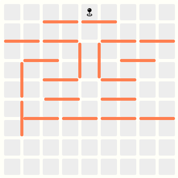
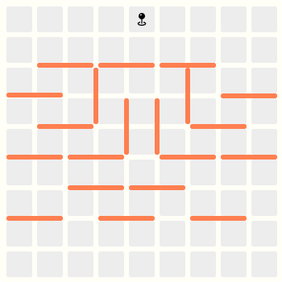
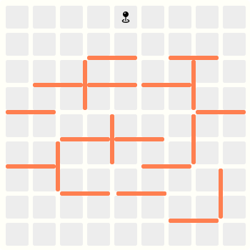
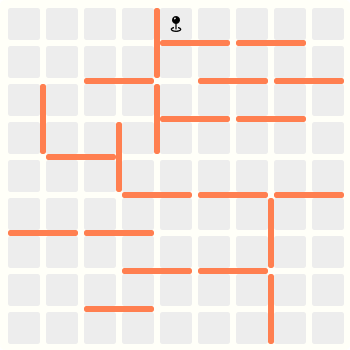
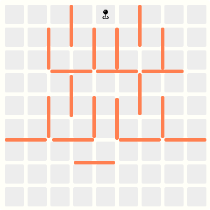
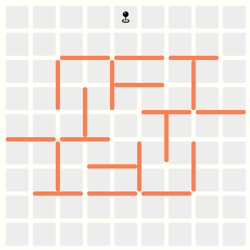
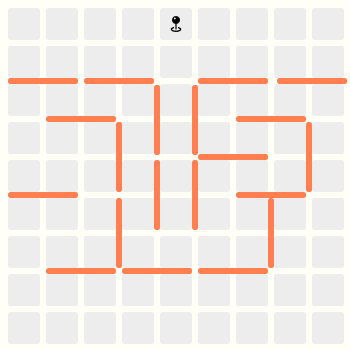
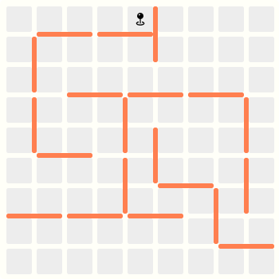

# Quoridor AI 강화학습 에이전트의   성능 향상을 위한 길찾기 알고리즘 비교 연구

## Abstract

본 연구는 Quoridouble 앱의 Quoridor AI 강화학습 에이전트 성능 향상을 위한 최적의 길찾기 알고리즘을 탐색하는 것을 목적으로 한다. Quoridor 게임의 복잡성과 AI 에이전트의 성능 향상 필요성을 고려할 때, 효율적인 길찾기 알고리즘의 선택이 중요하다. 본 연구에서는 BFS, DFS, A*, D* Lite, JPS와 같은 다양한 길찾기 알고리즘을 구현하고, 실험을 통해 성능을 비교 분석하였다. 분석 결과, D* Lite와 JPS 알고리즘이 Quoridor 게임 환경에서 가장 효율적인 성능을 보였으며, 계산 속도와 최적 경로 탐색 측면에서 우수한 결과를 나타냈다. 특히 최단 경로 탐색이 요구되는 상황에서 이 두 알고리즘이 실행 시간과 이동 횟수 측면에서 균형 잡힌 성능을 보여주었다. 본 연구는 Quoridor AI 에이전트에 D* Lite 또는 JPS 알고리즘을 상황에 따라 적절히 적용함으로써 게임 성능을 크게 향상시킬 수 있음을 보여주었으며, 이는 향후 Quoridouble 앱의 경쟁력 강화에 기여할 것으로 기대된다.

**Key Word**   강화학습(RL), 길찾기 알고리즘(PathFind Alg.), BFS, DFS, A*, D* Lite, Jump-Point-Search

## Experiment

실험에서 사용할 길찾기 알고리즘은 다음과 같다.

1. BFS (Breadth-First Search)
2. DFS (Depth-First Search)
3. A\*
4. D\* Lite
5. JPS (Jump-Point Search)

### 1. 실험 설계

실험은 먼저 가로형 맵 2종, 세로형 맵 2종, 대칭1출구형 맵 2종, 대칭다출구형 맵 2종, 복합형 맵 2종을 Quoridor의 규칙에서 허용하는 최대 벽 설치 개수인 20개의 벽을 설치하여 구현한다. 각각의 알고리즘은 해당 알고리즘에 대해 설명되어있는 논문 및 도서를 바탕으로 Quoridor의 규칙에 맞게 변형하여 구현한다. 구현된 맵과 알고리즘을 바탕으로 하나의 맵 당 하나의 알고리즘을 10번 실행한 후 평균 실행 시간과, 이동 거리와 같은 지표들을 산출하고, 알고리즘 별 평균 실행 시간과, 이동 거리를 산출한다.

### 2. 실행 환경 구성

실행 환경은 다음과 같다.

<table border="1">
  <tr>
    <td rowspan="3">
      Apple M3 
      APL1201 
      SoC
    </td>
    <td>Apple Everest 3.60GHz 4-core + Apple Sawtooth 2.48GHz 4-core</td>
  </tr>
  <tr>
    <td>Apple G16G 1,380 MHz 10-core</td>
  </tr>
  <tr>
    <td>Intergrated 24GB LPDDR5-6400)</td>
  </tr>
  <tr>
    <td>OS</td>
    <td>macOS Sequoia 15.0.1</td>
  </tr>
  <tr>
    <td>C++</td>
    <td>Apple Clang 16.0.0</td>
  </tr>
</table>

### 3. 맵의 구성

다음은 실험에서 사용하는 맵 10종이다.

<table border="1" cellpadding="10">
  <tr>
    <th>가로형</th>
    <th>세로형</th>
    <th>대칭 1출구형</th>
    <th>대칭 다출구형</th>
    <th>복합형</th>
  </tr>
  <tr>
    <td></td>
    <td></td>
    <td></td>
    <td></td>
    <td></td>
  </tr>
  <tr>
    <td></td>
    <td></td>
    <td></td>
    <td></td>
    <td></td>
  </tr>
</table>

### 4. 실험 결과

실험 결과는 아래와 같다.

**실행 시간(ms):**

<table border="1" cellpadding="5">
  <thead>
    <tr>
      <th>Map</th>
      <th>BFS</th>
      <th>DFS</th>
      <th>A*</th>
      <th>D* Lite</th>
      <th>JPS</th>
    </tr>
  </thead>
  <tbody>
    <tr>
      <td>01</td>
      <td>1.1734</td>
      <td>0.0570</td>
      <td>1.0477</td>
      <td>0.5516</td>
      <td>0.5626</td>
    </tr>
    <tr>
      <td>02</td>
      <td>1.4825</td>
      <td>0.0595</td>
      <td>1.3955</td>
      <td>0.5072</td>
      <td>0.9569</td>
    </tr>
    <tr>
      <td>03</td>
      <td>0.8713</td>
      <td>0.0682</td>
      <td>0.9481</td>
      <td>0.5700</td>
      <td>0.5922</td>
    </tr>
    <tr>
      <td>04</td>
      <td>0.9855</td>
      <td>0.0441</td>
      <td>0.9494</td>
      <td>0.5599</td>
      <td>0.5860</td>
    </tr>
    <tr>
      <td>05</td>
      <td>0.7602</td>
      <td>0.0350</td>
      <td>0.9964</td>
      <td>0.5583</td>
      <td>0.5195</td>
    </tr>
    <tr>
      <td>06</td>
      <td>0.9807</td>
      <td>0.0554</td>
      <td>0.8051</td>
      <td>0.5317</td>
      <td>0.5605</td>
    </tr>
    <tr>
      <td>07</td>
      <td>1.0483</td>
      <td>0.0401</td>
      <td>0.7628</td>
      <td>0.5430</td>
      <td>0.5409</td>
    </tr>
    <tr>
      <td>08</td>
      <td>1.0318</td>
      <td>0.0304</td>
      <td>1.0408</td>
      <td>0.5963</td>
      <td>0.6571</td>
    </tr>
    <tr>
      <td>09</td>
      <td>0.9192</td>
      <td>0.0532</td>
      <td>0.8358</td>
      <td>0.5460</td>
      <td>0.5947</td>
    </tr>
    <tr>
      <td>10</td>
      <td>1.6681</td>
      <td>0.0888</td>
      <td>1.5610</td>
      <td>0.5137</td>
      <td>0.8229</td>
    </tr>
  </tbody>
  <tfoot>
    <tr>
      <th>Avg.</th>
      <td>1.0921</td>
      <td>0.0532</td>
      <td>1.0342</td>
      <td>0.5478</td>
      <td>0.6393</td>
    </tr>
  </tfoot>
</table>

**이동 횟수(Steps):**

<table border="1" cellpadding="5">
  <thead>
    <tr>
      <th>Map</th>
      <th>BFS</th>
      <th>DFS</th>
      <th>A*</th>
      <th>D* Lite</th>
      <th>JPS</th>
    </tr>
  </thead>
  <tbody>
    <tr>
      <td>01</td>
      <td>44.0</td>
      <td>48.0</td>
      <td>44.0</td>
      <td>44.0</td>
      <td>44.0</td>
    </tr>
    <tr>
      <td>02</td>
      <td>41.0</td>
      <td>54.0</td>
      <td>41.0</td>
      <td>41.0</td>
      <td>41.0</td>
    </tr>
    <tr>
      <td>03</td>
      <td>38.0</td>
      <td>42.0</td>
      <td>38.0</td>
      <td>38.0</td>
      <td>38.0</td>
    </tr>
    <tr>
      <td>04</td>
      <td>23.0</td>
      <td>24.0</td>
      <td>23.0</td>
      <td>23.0</td>
      <td>23.0</td>
    </tr>
    <tr>
      <td>05</td>
      <td>24.0</td>
      <td>28.0</td>
      <td>24.0</td>
      <td>24.0</td>
      <td>24.0</td>
    </tr>
    <tr>
      <td>06</td>
      <td>25.0</td>
      <td>31.0</td>
      <td>25.0</td>
      <td>25.0</td>
      <td>25.0</td>
    </tr>
    <tr>
      <td>07</td>
      <td>25.0</td>
      <td>32.0</td>
      <td>25.0</td>
      <td>25.0</td>
      <td>25.0</td>
    </tr>
    <tr>
      <td>08</td>
      <td>24.0</td>
      <td>28.0</td>
      <td>24.0</td>
      <td>24.0</td>
      <td>24.0</td>
    </tr>
    <tr>
      <td>09</td>
      <td>25.0</td>
      <td>33.0</td>
      <td>25.0</td>
      <td>25.0</td>
      <td>25.0</td>
    </tr>
    <tr>
      <td>10</td>
      <td>44.0</td>
      <td>66.0</td>
      <td>44.0</td>
      <td>44.0</td>
      <td>44.0</td>
    </tr>
  </tbody>
  <tfoot>
    <tr>
      <th>Avg.</th>
      <td>31.3</td>
      <td>38.6</td>
      <td>31.3</td>
      <td>31.3</td>
      <td>31.3</td>
    </tr>
  </tfoot>
</table>

위 실험 결과에 따르면 평균 실행 시간은 DFS < D* Lite < JPS < A* < BFS 순으로 이동 횟수는 BFS = A* = D* Lite = JPS < DFS 순으로 나타났다. DFS는 실행 시간이 가장 빠르나 이동 횟수가 가장 많아, 최단 경로 탐색에는 부적합하다. 최단 경로 탐색 시 실행 시간과 이동 횟수를 고려하면 D\* Lite와 JPS가 효과적이다. 규칙 위반 방지가 중요한 상황에서는 DFS가 적합한 선택이 될 수 있다. 각 알고리즘의 성능은 특정 상황과 요구사항에 따라 다르게 평가될 수 있다.

## References

1. Thomas H. Cormen et el., "Introduction to Algorithms, 4th Edition" March 2022. p.554
2. Thomas H. Cormen et el., "Introduction to Algorithms, 4th Edition" March 2022. p.563
3. Peter E. Hart et el., "A Formal Basis for the Heuristic Determination of Minimum Cost Paths" IEEE July 1968.
4. Sven Koenig et el., "D\* Lite" AAAI July 2002.
5. Daniel Harabor et el., "Online Graph Pruning for Pathfinding on Grid Maps" AAAI August 2011.
6. Hidekatsu Furukawa, "알파제로를 분석하며 배우는 인공지능" Jpub June 2020.
